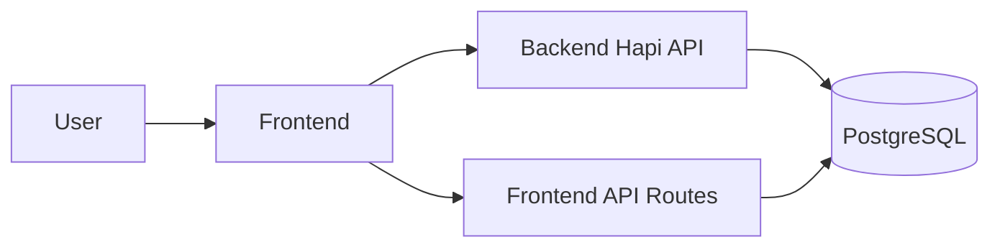
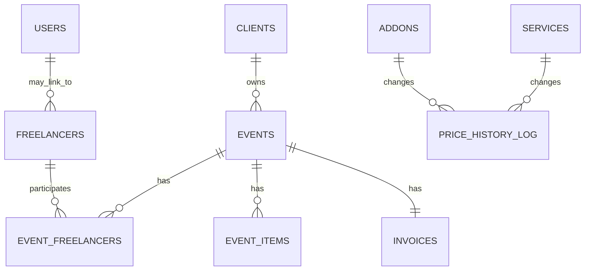

# HelloBooth — Dokumentasi Teknis Lengkap

Dokumentasi ini dibuat sebagai dokumentasi teknis lengkap dan juga sebagai context document yang dapat diberikan ke AI lain untuk memahami arsitektur, fitur, API, database, role, dan alur bisnis proyek tanpa harus membaca seluruh source code.

Peringatan: semua informasi di sini diambil langsung dari source code dan file schema/diagram yang ada di repository. Jika suatu bagian tidak ditemukan atau tidak dapat dipastikan dari kode, ditandai dengan ⚠️ "Perlu verifikasi dari source code/configuration.".

**Ringkasan singkat**

- Project Root: repository berisi dua sub-proyek utama: backend API (`hellobooth-backend`) dan frontend Next.js (`helloboothid`).

**Struktur ringkas repository**

- [hellobooth-backend](hellobooth-backend/package.json#L1-L50): Backend Node.js menggunakan Hapi.js dan PostgreSQL.
- [helloboothid](helloboothid/package.json#L1-L50): Frontend Next.js (React) aplikasi UI dan beberapa API route server-side.

---

## 1. Project Overview

- Nama project: HelloBooth (nama tercantum di file dokumentasi/struktur dan package.json).
- Tujuan: sistem manajemen layanan acara (event) yang menangani master data layanan dan addon, manajemen klien, pembuatan event dan item event, pembuatan invoice, manajemen freelancer dan assignment, dashboard pelaporan.
- Pengguna sistem: tim Sales (B2B/B2C), Owner/Admin, freelancer, dan kemungkinan pengguna internal lain.
- Fungsi utama: CRUD master data (services, addons), manajemen klien, pembuatan event dan item event, pembuatan invoice, manajemen freelancer dan assignment.
- Gambaran singkat bagaimana sistem bekerja: Frontend Next.js berinteraksi dengan backend Hapi.js melalui REST API (prefiks `/api/*`). Backend menyimpan data di PostgreSQL.

---

## 2. Project Scope

- Dicovered: management services, addons, clients, events, invoices, event items, freelancer assignments, price history log.
- Tidak ditemukan: integrasi pembayaran (payment gateway), sistem notifikasi otomatis, job scheduler, atau pengolahan payment reconciliation.
- Batasan: otentikasi JWT dipakai; beberapa route backend memerlukan auth (JWT). Frontend menyediakan route login yang mengeluarkan cookie `auth_token`.

---

## 3. Technology Stack

| Layer      | Technology                              | Purpose                                                                                     |
| ---------- | --------------------------------------- | ------------------------------------------------------------------------------------------- |
| Frontend   | Next.js (React)                         | UI, SSR/route handlers ([helloboothid/package.json](helloboothid/package.json#L1-L50))      |
| Backend    | Hapi.js                                 | REST API server ([hellobooth-backend/package.json](hellobooth-backend/package.json#L1-L50)) |
| Database   | PostgreSQL                              | Primary relational DB (used via `pg` Pool)                                                  |
| Auth       | JWT (`@hapi/jwt`, `jsonwebtoken`)       | Token-based authentication, cookie->header interceptor                                      |
| Validation | Joi                                     | Payload validation for services/addons/clients                                              |
| Password   | bcrypt                                  | Hashing and verification                                                                    |
| DB driver  | `pg`                                    | PostgreSQL client/Pool                                                                      |
| Dev tools  | nodemon, eslint, tailwindcss (frontend) | Development and lint/build tools                                                            |

---

## 4. System Architecture

Flow umum:



- Frontend: Next.js app (`helloboothid/src/app`) berisi halaman admin/owner/freelancer dan API route server-side (mis. `src/app/api/auth/login/route.ts`) yang mengakses DB via `src/lib/db.ts`.
- Backend: Hapi.js server (`hellobooth-backend/src/server.js`) mendaftarkan plugin API untuk services, addons, clients dan menggunakan JWT strategy. Backend membaca token JWT dari header; ada ekstensi `onRequest` yang memindahkan cookie `auth_token` ke header `Authorization` secara otomatis.

---

## 5. Repository / Folder Structure

Berikut ringkasan folder penting (disesuaikan dengan implementasi):

```
hellobooth-backend/
├── src/
│   ├── api/ (plugins: services, addons, clients)
│   ├── services/postgres/ (DB services untuk master data)
│   ├── validator/ (Joi schema)
│   └── server.js

helloboothid/
├── src/
│   ├── app/ (Next.js pages/layouts dan API routes)
│   ├── lib/db.ts (PG pool untuk Next API)
│   └── services/ (frontend service wrappers)
```

- `hellobooth-backend/src/api` → implementasi plugin Hapi untuk modul `services`, `addons`, `clients` ([hellobooth-backend/src/api/addons/routes.js](hellobooth-backend/src/api/addons/routes.js#L1-L20)).
- `hellobooth-backend/src/services/postgres` → kelas service yang menjalankan query PostgreSQL (mis. `ServicesService`, `AddonsService`, `ClientsService`).
- `hellobooth-backend/src/validator` → schema Joi untuk payload validasi.
- `helloboothid/src/app/api` → route API Next.js (mis. `auth/login/route.ts`) menggunakan `src/lib/db.ts` untuk query.

---

## 6. User Roles

Berdasarkan implementasi kode (JWT payload and checks):

- `role`: umum (mis. `Admin`, `Owner`, `User`) — disimpan di token JWT payload.
- `sub_role`: divisi atau peran lebih spesifik (mis. `sales_b2b`, `sales_b2c`, `manager`, dsb.) — dipakai untuk memfilter data dan otorisasi operasi (lihat `ClientsHandler` dan login route).

Hak akses yang ditemukan:

- Menambah / menghapus client: hanya tim Sales (dicek dengan `sub_role` yang mengandung "sales", "b2b", atau "b2c"). ([hellobooth-backend/src/api/clients/handler.js](hellobooth-backend/src/api/clients/handler.js#L1-L80))
- Beberapa endpoint memiliki `options: { auth: "jwt" }` pada route (lihat `clients/routes.js`). Backend mendaftarkan strategy `jwt` di `server.js`.

⚠️ Perlu verifikasi: daftar role lengkap dan mapping ke halaman akses UI; role & sub_role berasal dari tabel `users` (lihat `helloboothid/docs/erd.puml`).

---

## 7. Authentication & Authorization

- Login flow frontend (Next API):
  - Endpoint: `POST` di Next API route `src/app/api/auth/login/route.ts` — mencocokkan username/password dengan tabel `users` menggunakan bcrypt.
  - Jika valid, server membuat JWT yang menyertakan `id`, `role`, dan `sub_role`, lalu men-set cookie `auth_token` (httpOnly) dengan token tersebut.
  - Frontend mengandalkan cookie `auth_token` untuk akses; backend Hapi memiliki `onRequest` hook yang memindahkan cookie ini menjadi header `Authorization: Bearer <token>` agar strategy JWT Hapi dapat memverifikasi.

- Backend JWT strategy: di `hellobooth-backend/src/server.js` — menggunakan `@hapi/jwt`, key diambil dari `process.env.JWT_SECRET` atau fallback `'super-secret-key-anda'`. Token diverifikasi tanpa `aud/iss/sub`, dan `maxAgeSec` diset 86400 detik.

- Password hashing: penggunaan `bcrypt` pada saat verifikasi di route login. (hashing pembuatan user tidak terlihat di repo; kemungkinan ada skrip pembuatan user manual atau migrasi).

Keamanan: jangan menyimpan atau menampilkan nilai secret. Nama variabel ditemukan: `JWT_SECRET`, `PGPASSWORD`, `PGHOST`, `PGUSER`, `PGDATABASE`, `PGPORT`.

---

## 8. Application Pages / Routes

Frontend memiliki banyak halaman Next.js di `helloboothid/src/app`, antara lain:

- Halaman admin/owner/dashboard, calendar, clients, events, freelancers.
- API route contoh: `POST /api/auth/login` implemented in [helloboothid/src/app/api/auth/login/route.ts](helloboothid/src/app/api/auth/login/route.ts#L1-L200).

Backend API routes (Hapi) — prefix `/api`:

- Services
  - `POST /api/services` — tambah layanan ([hellobooth-backend/src/api/services/routes.js](hellobooth-backend/src/api/services/routes.js#L1-L80))
  - `GET /api/services` — ambil daftar layanan
  - `PUT /api/services/{id}` — edit layanan
  - `DELETE /api/services/{id}` — hapus layanan
- Addons
  - `POST /api/addons` — tambah addon
  - `GET /api/addons` — daftar addons
  - `PUT /api/addons/{id}` — edit addon
  - `DELETE /api/addons/{id}` — hapus addon
- Clients (semua route ada `auth: "jwt"` pada route config)
  - `POST /api/clients` — tambah client (dibatasi untuk sales)
  - `GET /api/clients` — daftar client (difilter berdasarkan `sub_role`)
  - `GET /api/clients/{id}` — detail client + events
  - `PUT /api/clients/{id}` — edit client
  - `DELETE /api/clients/{id}` — hapus client (dibatasi untuk sales)

---

## 9. Main Features

Berikut fitur utama yang benar-benar diimplementasikan berdasarkan kode:

- Master Data Layanan (`services`): CRUD, price history logging saat update (`price_history_log`). ([ServicesService.js](hellobooth-backend/src/services/postgres/ServicesService.js#L1-L200))
- Master Data Addons (`addons`): CRUD, price history logging saat update. ([AddonsService.js](hellobooth-backend/src/services/postgres/AddonsService.js#L1-L200))
- Client Management (`clients`): CRUD, pembatasan pembuatan dan penghapusan ke peran Sales, filtering list berdasarkan `sub_role`. ([ClientsService.js](hellobooth-backend/src/services/postgres/ClientsService.js#L1-L200))
- Authentication (login) via Next API route, menghasilkan JWT dan cookie `auth_token`. ([helloboothid/src/app/api/auth/login/route.ts](helloboothid/src/app/api/auth/login/route.ts#L1-L200))
- Price history tracking: setiap perubahan harga layanan/addon disimpan ke `price_history_log`.

---

## 10. Business Logic & Business Rules

Ringkas implementasi aturan bisnis yang ditemukan:

- Penambahan client: hanya `sub_role` yang mengandung kata "sales", "b2b" atau "b2c" yang boleh menambahkan klien. Jika `client_type` tidak diberikan, sistem otomatis menetapkan `B2C` kecuali sub_role mengandung "b2b" (maka `B2B`). ([ClientsHandler.postClientHandler](hellobooth-backend/src/api/clients/handler.js#L1-L80)).

- Pembatasan penghapusan client: hanya tim Sales yang dapat menghapus client (cek `sub_role`). ([ClientsHandler.deleteClientByIdHandler](hellobooth-backend/src/api/clients/handler.js#L1-L200)).

- Price update: saat layanan atau addon diubah, sistem mencatat entri di tabel `price_history_log` berisi old/new price (kolom untuk price_b2b/price_b2c dan base_price). Ini memungkinkan audit perubahan harga. ([ServicesService.editServiceById](hellobooth-backend/src/services/postgres/ServicesService.js#L1-L200)).

- Data access filtering: `ClientsService.getClients(subRole)` akan memfilter klien berdasarkan `sub_role` (B2B/B2C) sehingga user di divisi berbeda melihat subset klien mereka.

Formulasi harga (implisit): total invoice/event price tidak ditunjukkan langsung di kode yang dianalisis untuk bagian event/invoice dalam backend ini, namun ERD dan service code menunjukkan bahwa `services` memiliki `price_b2b` dan `price_b2c`, sedangkan `addons` memiliki `base_price`. Implementasi perhitungan invoice / total event kemungkinan dilakukan di modul lain atau di level aplikasi (⚠️ Perlu verifikasi dari source code/configuration jika ingin rumus pasti invoice).

---

## 11. Event Workflow

ERD dan query menunjukkan adanya tabel `events` dengan status dan relasi ke `invoices` serta `event_items`. Dari ERD (docs/erd.puml) lifecycle umum yang kemungkinan diterapkan:

- Create Event → (there is link to invoice creation in ERD comments)
- Booking/Upcoming → Ongoing → Completed

⚠️ Perlu verifikasi: detail status lifecycle dan kondisi transisi status (kode update status event tidak tampak pada modul yang saya buka).

---

## 12. Invoice & Payment Workflow

- Terdapat tabel `invoices` di ERD (`docs/erd.puml`) dengan kolom `total_amount`, `paid_amount`, `payment_status`, `discount_amount`.
- Relasi: `events` → `invoices` (1:1) sesuai ERD.

Namun implementasi pembuatan invoice otomatis atau proses pembayaran tidak ditemukan di modul backend yang dianalisis (⚠️ Perlu verifikasi). Jika ada, kemungkinan terdapat di modul event/invoice yang belum dibuka.

---

## 13. Freelancer Management

- ERD mencantumkan tabel `freelancers` dan `event_freelancers` (junction table) yang menunjukkan assignment freelancer ke event.
- Detailed assignment logic (quota, availability checking, schedule) tidak ditemukan di file yang saya baca; kemungkinan ada modul lain atau belum diimplementasikan secara lengkap. Marking: ⚠️ Perlu verifikasi.

---

## 14. Dashboard & Reporting

- Frontend memiliki folder dashboard dan berbagai halaman yang menunjukkan metrik (owner/dashboard, freelancers/dashboard, events/dashboard). Perhitungan metric seperti omzet, B2B/B2C revenue, dan leaderboard kemungkinan dihitung di API atau di query SQL pada modul dashboard yang belum kami telusuri sepenuhnya.

---

## 15. Database Overview

Sumber utama: `docs/erd.puml` dan query SQL di `ServicesService`, `AddonsService`, `ClientsService`.

Daftar tabel yang dapat diidentifikasi:

| Table             | Purpose                  | Important Columns                                                              |
| ----------------- | ------------------------ | ------------------------------------------------------------------------------ |
| users             | akun user                | id, username, password, role, sub_role                                         |
| freelancers       | freelancer master        | id, user_id, name, phone, role, status                                         |
| clients           | client master            | id, name, email, phone, client_type                                            |
| events            | event / booking          | id, client_id, event_name, event_date, location, total_price, status, sales_id |
| event_items       | snapshot items for event | id, event_id, item_id, item_type, item_name, item_price, quantity              |
| services          | master services          | id, name, price_b2b, price_b2c                                                 |
| addons            | master addons            | id, name, base_price                                                           |
| invoices          | invoice per event        | id, event_id, total_amount, paid_amount, payment_status, discount_amount       |
| event_freelancers | assignment junction      | id, event_id, freelancer_id, assigned_role                                     |
| price_history_log | audit log price changes  | service_id, addon_id, old/new prices, changed_at                               |

---

## 16. Database ERD

ERD tersedia di `helloboothid/docs/erd.puml`. Berikut diagram ringkas (Mermaid) diambil/dikonversi dari file yang ada:



---

## 17. Database Relationships

- Satu client dapat memiliki banyak event.
- Satu event dapat memiliki banyak event_items (snapshot master data saat event dibuat).
- Satu event memiliki satu invoice.
- Banyak-to-banyak event↔freelancer melalui `event_freelancers`.

---

## 18. API Documentation (Ringkasan)

Kelompok endpoint backend utama (Hapi):

- Auth: login ada di frontend Next API (`/api/auth/login`) yang menghasilkan JWT cookie.
- Clients: CRUD di `/api/clients` (jwt auth required). See [clients/routes.js](hellobooth-backend/src/api/clients/routes.js#L1-L80).
- Services: CRUD di `/api/services`.
- Addons: CRUD di `/api/addons`.

Contoh format dokumentasi untuk satu endpoint:

`POST /api/clients`

- Auth: JWT (cookie -> header interceptor) — required.
- Role: hanya `sub_role` matching sales/B2B/B2C dapat membuat.
- Body: `{ name, email, phone, client_type? }` (validated by Joi)
- Response: `201` + `{ status: 'success', data: { clientId } }` atau `4xx` error.

---

## 19. API Flow (contoh)

User submits Client Form → Frontend sends `POST /api/clients` dengan cookie `auth_token` → Next/Hapi server memindahkan cookie menjadi header `Authorization` → Hapi JWT strategy mem-validate token → Handler `ClientsHandler.postClientHandler` memvalidasi payload dan memeriksa `sub_role` → `ClientsService.addClient` menyimpan data ke PostgreSQL → response dikembalikan.

---

## 20. Validation & Error Handling

- Backend validation menggunakan Joi schemas: `services/schema.js`, `addons/schema.js`, `clients/schema.js`. Payload invalid menyebabkan error 400 dengan pesan Joi.
- Handler membungkus operasi dengan try/catch dan mengembalikan response berstruktur `{ status, message }`.

---

## 21. Status & Enum Reference

Status yang ditemukan di ERD/usage:

- Event status: kemungkinan `Upcoming`, `Ongoing`, `Completed`, `Cancelled` (ERD menunjukkan adanya kolom `status`, tapi enumerasi tidak eksplisit di kode). ⚠️ Perlu verifikasi.
- Payment status: kemungkinan `Unpaid`, `Down Payment`, `Paid`, `Overdue` (disebutkan di ERD). ⚠️ Perlu verifikasi.

---

## 22. UI / UX Structure

- Next.js app menggunakan folder `app/` dengan layout global dan nested route untuk admin/owner/freelancer. Struktur sidebar/navigation dan halaman utama tersedia di `src/app/*`.
- Komponen UI lain berada di `src/components` (tidak semua file dibaca secara eksplisit dalam analisis singkat ini).

---

## 23. Environment Variables

Variabel environment yang digunakan / terdeteksi dari kode:

```
PORT, HOST
JWT_SECRET
PGUSER, PGHOST, PGDATABASE, PGPASSWORD, PGPORT
NODE_ENV
```

Jangan commit nilai sensitif. Jika menemukan rahasia dalam repo, catat sebagai isu. (Saya tidak menemukan secret literal yang dikomit.)

---

## 24. Installation & Setup

Langkah menjalankan proyek lokal (dua sub-proyek terpisah):

1. Clone repository
2. Backend setup (`hellobooth-backend`):

```bash
cd hellobooth-backend
npm install
# siapkan .env dengan DB credentials dan JWT_SECRET
npm run dev  # menjalankan nodemon src/server.js
```

3. Frontend setup (`helloboothid`):

```bash
cd helloboothid
npm install
# siapkan .env (PG connection vars, JWT_SECRET sama dengan backend jika menggunakan token yang sama)
npm run dev
```

Catatan: `helloboothid/src/lib/db.ts` menggunakan `PG*` env vars; pastikan PostgreSQL berjalan dan database tersedia.

---

## 25. Database Setup

- Nama database default di code: `hellobooth_db` (default di `helloboothid/src/lib/db.ts`), namun ini bisa ditimpa dengan `PGDATABASE` env var.
- Tidak ditemukan file migration SQL dalam repository yang dianalisis; kemungkinan skema dibuat manual atau lewat skrip terpisah.

Langkah umum:

1. Buat database PostgreSQL: `createdb hellobooth_db` (atau sesuai `PGDATABASE`).
2. Jalankan DDL/migration jika tersedia (tidak ditemukan di repo) atau gunakan DDL dari `docs/erd.puml` sebagai panduan manual.

⚠️ Perlu verifikasi: tidak ada migration scripts (seharusnya ditambahkan jika ingin reproducible DB setup).

---

## 26. Development Commands

- Backend `hellobooth-backend` (lihat [package.json](hellobooth-backend/package.json#L1-L50)):
  - `npm run start` — `node src/server.js`
  - `npm run dev` — `nodemon src/server.js`
- Frontend `helloboothid` (lihat [package.json](helloboothid/package.json#L1-L50)):
  - `npm run dev` — `next dev`
  - `npm run build` — `next build`
  - `npm run start` — `next start`

---

## 27. Testing

- Tidak ditemukan automated tests (unit/integration) di repository. Jika ada, tidak jelas dari struktur yang dianalisis.

---

## 28. Deployment

- Tidak ditemukan konfigurasi deployment (Dockerfile, GitHub Actions, atau infra IaC) di root repository. Deployment steps perlu dibuat manual.

---

## 29. Security Considerations

- Authentication: JWT (cookie + header interceptor); tokens expire `1d`.
- Passwords: stored hashed (bcrypt) — login route compares menggunakan `bcrypt.compare`.
- Input validation: Joi schemas on backend handlers to prevent malformed input.
- DB queries: parameterized queries using `pg` (prepared values) — menurunkan risiko SQL injection.
- Potential risks: fallback secret `super-secret-key-anda` terlihat sebagai default dalam code — wajib override `JWT_SECRET` di production.

---

## 30. Known Limitations

- Tidak ada migration scripts / seeds.
- Deployment pipeline/config tidak ada.
- Fitur pembayaran/integrasi tidak ditemukan.
- Beberapa workflow (event status transitions, invoice generation) perlu verifikasi atau modul tambahan.

---

## 31. Future Development

- Tambahkan migration (eg. using Knex/migrate or TypeORM/migrations)
- Tambahkan automated tests
- Tambahkan deployment configuration (Docker, CI)
- Lengkapi modul event/invoice jika belum lengkap

---

## 32. Important Files

- [hellobooth-backend/src/server.js](hellobooth-backend/src/server.js#L1-L200) — entrypoint backend, JWT strategy, plugin register.
- [hellobooth-backend/src/api/clients/handler.js](hellobooth-backend/src/api/clients/handler.js#L1-L200) — business rules clients (sales-only create/delete).
- [hellobooth-backend/src/services/postgres/ServicesService.js](hellobooth-backend/src/services/postgres/ServicesService.js#L1-L200) — services CRUD + price history.
- [hellobooth-backend/src/services/postgres/AddonsService.js](hellobooth-backend/src/services/postgres/AddonsService.js#L1-L200) — addons CRUD + price history.
- [hellobooth-backend/src/services/postgres/ClientsService.js](hellobooth-backend/src/services/postgres/ClientsService.js#L1-L200) — clients queries and filtering.
- [helloboothid/src/app/api/auth/login/route.ts](helloboothid/src/app/api/auth/login/route.ts#L1-L200) — login route issuing JWT cookie.
- [helloboothid/src/lib/db.ts](helloboothid/src/lib/db.ts#L1-L200) — DB pool config for Next API routes.
- [helloboothid/docs/erd.puml](helloboothid/docs/erd.puml#L1-L200) — ERD diagram source.

---

## AI PROJECT CONTEXT

```
PROJECT: HelloBooth

PURPOSE: Sistem manajemen layanan acara untuk mengelola services, addons, clients, events, invoices, dan assignment freelancer.

STACK: Frontend Next.js (React), Backend Hapi.js (Node.js), PostgreSQL, JWT auth, Joi validation, bcrypt

ARCHITECTURE: Frontend (Next) berinteraksi dengan backend Hapi API (/api/*). Frontend juga memiliki server-side API routes yang mengakses DB langsung. Backend menggunakan JWT strategy dan memindahkan cookie auth_token ke header Authorization.

USERS / ROLES: role (umum), sub_role (divisi seperti sales_b2b/sales_b2c). Sales hanya boleh menambahkan/menghapus client.

CORE FEATURES: CRUD services/addons (dengan price history), CRUD clients (filtered by sub_role), login via JWT cookie, basic frontend UI pages (dashboard, clients, events, freelancers).

DATABASE: PostgreSQL. Tabel penting: users, freelancers, clients, events, event_items, services, addons, invoices, event_freelancers, price_history_log.

MAIN BUSINESS RULES: Sales-only create/delete client; client list filtered by sub_role (B2B/B2C); price updates logged to price_history_log.

AUTHENTICATION: Login via Next API route, JWT in cookie `auth_token`, backend Hapi converts cookie->header and validates JWT via @hapi/jwt. Env var: JWT_SECRET.

AUTHORIZATION: Route-level `auth: "jwt"` and handler-level checks (sub_role inspection) enforce permissions.

IMPORTANT STATUS: event.status (lifecycle unclear — needs verification); invoice.payment_status (Unpaid/Down Payment/Paid/Overdue — needs verification).

IMPORTANT API MODULES: hellobooth-backend/src/api/{services,addons,clients}; helloboothid/src/app/api/auth/login/route.ts

IMPORTANT FILES: see "Important Files" section above.

CURRENT LIMITATIONS: no migrations, no payment gateway integration, limited testing, missing deployment config, some workflows need verification (event/invoice lifecycle).

IMPORTANT NOTES:
- Jangan gunakan default JWT secret in production.
- Verifikasi skema DB dan tambahkan migration/seed untuk reproducibility.
```

---

Jika Anda ingin, saya bisa:

- Menambahkan migration SQL/DDL template berdasarkan `erd.puml`.
- Menelusuri modul event/invoice lebih dalam untuk mengekstrak formula perhitungan invoice.
- Menambahkan file `README.md` ini ke repository (saya sudah membuatnya di root).

---

Dokumentasi dibuat berdasarkan analisis kode yang tersedia. Untuk verifikasi lanjutan, beri tahu area mana yang ingin Anda prioritaskan.
